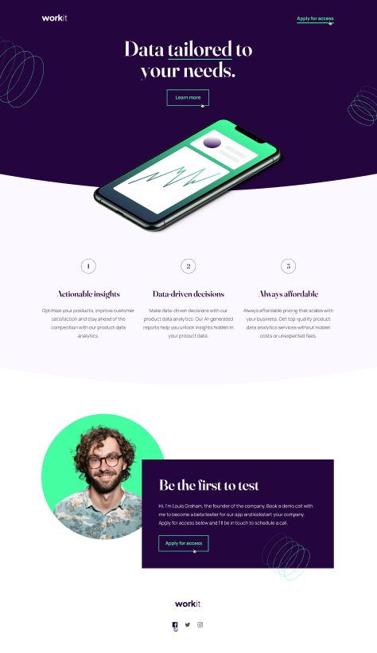

## # Frontend Mentor - Workit landing page solution

Está é minha solução para o desafio [Workit landing page challenge on Frontend Mentor](https://www.frontendmentor.io/challenges/workit-landing-page-2fYnyle5lu). 

**Note: Delete this note and update the table of contents based on what sections you keep.**

### Screenshot

### Links

- Solution URL: [Add solution URL here](https://your-solution-url.com)
- Live Site URL: [Add live site URL here](https://your-live-site-url.com)

## Meu processo

### Construido com

- Semantic HTML5 markup
- CSS custom properties
- Flexbox
- CSS Grid
- Mobile-first workflow

### Desenvolvimento Continuo

Desejo me aprofundar em estilizações mais complexas, utilizando animações e transformações em minhas divs.

### Recursos uteis

- [YouTube - Aplicando curvas no header](https://www.youtube.com/watch?v=mqzSY6Qy0yk) - Video aula me ajudou a entender como funciona a aplicação de curvas complexas em elementos header, section, div, etc.
- [Pseudo Elemento Before](https://www.w3schools.com/css/css_pseudo_elements.asp) - Documentação css me ajudou a utilizar o pseudo elemento before da maneira correta.

# Author
### Josué Ocanha Costa

- Github - [JosueCosta2023](https://github.com/JosueCosta2023)
- Frontend Mentor - [@JosueCosta2023](https://www.frontendmentor.io/profile/JosueCosta2023)
- Twitter - [@JosueOcanhaCosta](https://twitter.com/josue_ocanha)

## Agradecimentos

Agradeço ao FrontEnd Mentor, obrigado a toda equipe.
Aguardo maiores desafios. 
"Vida longa e próspera" 🖖
